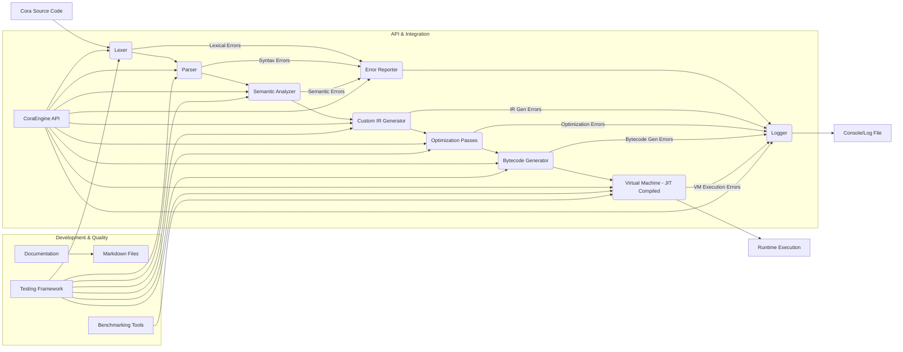

# Cora JIT Compiler Architecture

This document outlines the architecture of the C++ based Cora Just-In-Time (JIT) compiler, designed to compile and execute Cora code dynamically within a C++ application. The system is structured into several core components, each responsible for a specific stage of the compilation and execution pipeline. Enhanced error handling and reporting are integrated throughout the front-end stages to provide developers with clear feedback. This revision introduces Virtual Machine (VM) support for executing generated bytecode, with JIT compilation capabilities for the VM. The overall design emphasizes modularity, extensibility, a simple API, comprehensive documentation, robust error handling, logging, and testability.

## Overview

The Cora JIT Compiler acts as a library that can be embedded within a C++ application. It accepts Cora source code as input and produces executable code at runtime. The architecture is modular, allowing for independent development and enhancement of each compilation stage. A robust error reporting system and a compilation process logger are key features to aid debugging and development. This version introduces a custom backend, featuring a custom SSA-based Intermediate Representation (IR), optimization passes, a bytecode generator, and a JIT-compiled Virtual Machine for execution.

## Core Components

1.  **Lexer:**
    *   **Purpose:** Scans the input Cora source code and breaks it down into a stream of meaningful tokens.
    *   **Input:** Raw Cora source code string.
    *   **Output:** A sequence of tokens.
    *   **Error Handling:** Detects and reports lexical errors with precise location information.

2.  **Parser:**
    *   **Purpose:** Takes the token stream from the Lexer and constructs an Abstract Syntax Tree (AST).
    *   **Input:** Token stream.
    *   **Output:** Abstract Syntax Tree (AST).
    *   **Error Handling:** Detects and reports syntax errors with precise location information.

3.  **Semantic Analyzer:**
    *   **Purpose:** Analyzes the AST for semantic correctness (type checking, name resolution, etc.).
    *   **Input:** AST.
    *   **Output:** A semantically validated AST, potentially transformed or annotated.
    *   **Error Handling:** Detects and reports semantic errors with informative messages.

4.  **Custom IR Generator:**
    *   **Purpose:** Translates the semantically analyzed AST into a custom Static Single Assignment (SSA) based Intermediate Representation (IR).
    *   **Input:** Semantically validated AST.
    *   **Output:** Custom SSA IR.

5.  **Optimization Passes:**
    *   **Purpose:** A suite of passes applied to the custom IR to improve code performance.
    *   **Input:** Custom SSA IR.
    *   **Output:** Optimized Custom SSA IR.

6.  **Bytecode Generator:**
    *   **Purpose:** Translates the optimized custom IR into a custom bytecode format suitable for the Virtual Machine.
    *   **Input:** Optimized Custom SSA IR.
    *   **Output:** Executable Bytecode.

7.  **Virtual Machine (VM) with JIT Compilation:**
    *   **Purpose:** Executes the generated bytecode, either through interpretation or by JIT-compiling bytecode to native machine code. Manages VM stack, heap, and host interaction.
    *   **Input:** Executable Bytecode.
    *   **Output:** Executed Cora function/program.
    *   **Features:** Supports function calls, control flow, memory management, extensibility, error handling, logging, and profiling.

## Error Reporting and Logging

Inspired by Rust and GCC:
- **Error Levels:** Note, Warning, Error, Fatal.
- **Snippets:** Display the source line with the error highlighted.
- **Suggestions:** "Did you mean ...?" style feedback.
- **Implementation:** A `DiagnosticEngine` class that manages a collection of `Diagnostic` objects.
*   **Error Reporter:** Aggregates and formats error messages from all stages.
*   **Logger:** Records compilation and execution process steps, warnings, and errors.

## Modularity, Extensibility, and API Design

*   **Modularity:** Each component is a distinct C++ class/module with well-defined interfaces.
*   **Extensibility:** The design allows for swapping components (e.g., different optimization passes, JIT strategies) and adding support for new Cora features. The VM instruction set and JIT mechanisms are designed for future expansion.
*   **Simple API:** The `CoraEngine` class provides a straightforward interface for embedding the JIT compiler in C++ projects. Key methods will include compilation, execution, and error/log retrieval.
*   **Documentation:** Comprehensive documentation, including this architecture overview, design decisions, implementation details, and usage examples, is crucial. Markdown files are used for this purpose.

## Development and Quality Assurance

*   **Testing Framework:** Unit tests are essential for each component (Lexer, Parser, Semantic Analyzer, IR Generator, Bytecode Generator, VM interpreter/JIT). Integration tests will verify the end-to-end pipeline.
*   **Benchmarking Tools:** Performance benchmarks will be implemented to evaluate the efficiency of generated code and identify areas for optimization within the JIT compiler and VM.

## Embedding and API

The `CoraEngine` class will be the primary interface. It will manage the compilation pipeline, error reporting, logging, and interaction with the Virtual Machine. Methods will be provided for:

*   Initializing the engine.
*   Compiling Cora source code to bytecode.
*   Loading and executing bytecode.
*   Retrieving compilation results, errors, and logs.
*   Configuring VM execution modes (interpreter vs. JIT).
*   Accessing profiling data.
